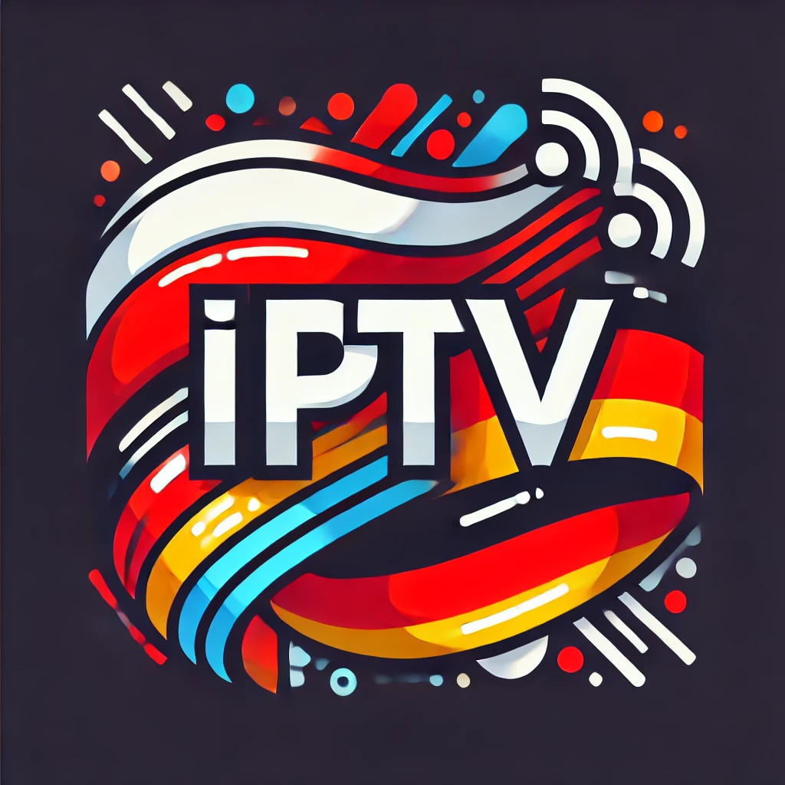

<div align="center">
  
</div>

Adres URL trzeba umieścić w miejscu listy m3u w aplikacjach.

## IPTV2023.m3u

POLSKA IPTV 2024 (grupy zródłami kanałów)
```
https://bit.ly/IPTV-PL
```


## IPTV2024.m3u

POLSKA IPTV 2024 (grupy tematycznie)
```
https://bit.ly/IPTVPL
```


## IPTVDE.m3u

DE IPTV 2024 (grupy kanałami)
```
https://bit.ly/DE-IPTV
```


### *Aktualizuje przynajmniej raz w tygodniu*

EPG 5 DNI
```
https://epg.ovh/pl.xml
```
EPG 10 DNI
```
https://epg.ovh/plar.xml
```


## **Aplikacje IPTV**

WINDOWS:

MyIPTV Player (Microsoft Store) (Win10/ Win11)

https://apps.microsoft.com/detail/9pjj2nmbf0tr?hl=en-US&gl=US


VLC 3.0.18 x64

https://downloads.videolan.org/pub/videolan/vlc/3.0.18/win64/vlc-3.0.18-win64.exe


KODI 20.2 Nexus x64

https://mirrors.kodi.tv/releases/windows/win64/kodi-20.2-Nexus-x64.exe


ANDROID / ANDROID TV

Televizo 1.9.1.5 (apk / MOD)

https://mega.nz/file/N8JykBDT#L0H35o0oFFAYLyZqbmvzn6tuEihlnMTlSl02_h_JWfA


IPTV Pro v7.0.3 (apk / MOD)

https://mega.nz/file/g84mgQAS#rFEN1Sh0dARdqngY1nkkFYOo6OnA_Z4b1iKE2iyQKWE


Tivimate v3.0.1 (apk / MOD)

https://mega.nz/file/phxjVTLL#Z7w8xZbncj-GzwVIKBjoOTHl2m3cHB7Fvu5UganCGJc


iOS / iPhone:

iSTB 1.25.2 (ipa / MOD)

https://mega.nz/file/1oAkmDRC#elawmiVO72-NOLYaCrmRE4kuqLUxrPknx78qPb8Vpr4


Kodi v20 Nexus (ipa)

https://mega.nz/file/80BGRKbT#gBlVI8geKjpOsSHBr4YYFzx7o9F2-_jlpztL8zO4duk


:star: NIE BIORE ODPOWIEDZIALNOŚCI ZA WYKORZYSTANIE POWYŻSZYCH PLIKÓW I LINKÓW :star:

:star: WYKONANO W CELACH EDUKACYJNYCH :star:

:star: NIE POSIADAM PRAWA DO NADAWANIA ANI UŻYTKOWANIA KANAŁOW TELEWIZYJNYCH ANI STEAMINGOWYCH :star:

:star: UŻYWASZ NA WŁASNĄ ODPOWIEDZIALOŚĆ!!! :star:
